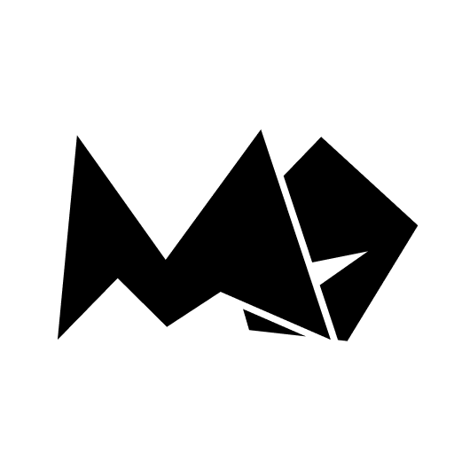
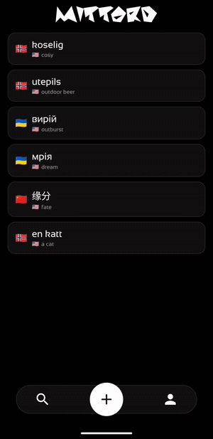

  

<h1 align="center">MittOrd</h1>

  A vocabulary app for Android. 
  Save a word, give it translations in any language, find it again later.

  Built while learning Norwegian — <i>mitt ord</i> means "my word".

 

<table align="center">
  <tr>
    <td align="center" width="50%">
      
    </td>
    <td align="center" width="50%">
      
    </td>
  </tr>
  <tr>
    <td align="center">Adding a word</td>
    <td align="center">Search</td>
  </tr>
</table>

<!--
Screenshots: drop home.png (and optionally settings.png) into docs/screenshots/
and uncomment. The word editor is left out on purpose - it is waiting on a
redesign, and the shot would go stale.

<table align="center">
  <tr>
    <td align="center" width="50%">
      
    </td>
    <td align="center" width="50%">
      
    </td>
  </tr>
  <tr>
    <td align="center">Word list</td>
    <td align="center">Profile</td>
  </tr>
</table>
-->

 

## Disclaimer

A personal project, built for learning.

Translation and language detection use an unofficial Google Translate endpoint
that needs no API key. It has no stable contract and may stop working at any
time. Not suitable for production.

## License

Copyright © 2026 Andrii Patiuk (KanashiReinkyatto). All rights reserved.

The source is published so it can be read, not reused. See [LICENSE](LICENSE).
